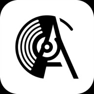

<div align="center">



# The Archive

**The Personal AI Music Curator.**

> *"Don't just play music. Curate the vibe."*

[](https://biplavbarua.github.io/the-archive/)
[](https://opensource.org/licenses/MIT)

[**Launch Live Demo**](https://biplavbarua.github.io/the-archive/)

</div>

---

**The Archive** is a local-first, AI-powered music player that connects your listening history with a World-Class Robot DJ. It goes beyond simple "Similar Songs" algorithms by understanding the *Arc* of your listening session.

## ✨ Why The Archive?

Most music players relies on "Collaborative Filtering" (what *others* liked). The Archive uses **Large Language Models (LLMs)** to analyze the **Sonic Texture** and **Cultural Context** of a track, acting like a knowledgeable musicologist sitting right next to you.

### 🧠 Algorithm 3.0 (The "Musicologist")
-   **Anti-Loop Memory**: Actively prevents the "same 5 songs" fatigue by remembering session history.
-   **Vibe Continuity**: Detects if you're "Building Up" (Energy increasing) or "Cooling Down" and selects tracks to match the trajectory.
-   **Intelligent Skip Logic**: If you skip a song instantly, the AI interprets it as a "Vibe Kill" and avoids that sub-genre for the rest of the session.

### 🎛️ Pro Player Features
-   **Infinite Mode (INF)**: Seamlessly generates an endless queue of recommendation.
-   **Audiophile Filtering**: Aggressively strips out "Reaction Videos", "Shorts", and "Low Quality" uploads from YouTube.
-   **Local-First Privacy**: Your data stays in your browser. No central server tracking your every move.
-   **PWA Ready**: Installable on iOS and Android with native-like performance and splash screens.

## 🛠️ Getting Started

Running your own instance is simple. This app is **Serverless**, meaning it runs entirely in your browser.

### Prerequisites
*   **Node.js**: v18 or higher.
*   **YouTube Data API Key**: [Get one for free here](https://console.cloud.google.com/apis/credentials).

### Quick Start
1.  **Clone the Repo**
    ```bash
    git clone https://github.com/biplavbarua/the-archive.git
    cd the-archive
    ```
2.  **Install Dependencies**
    ```bash
    npm install
    ```
3.  **Run Locally**
    ```bash
    npm run dev
    ```

### Configuration
1.  Open the app (`http://localhost:5173/the-archive/`).
2.  Click the **Settings (Gear)** icon.
3.  Enter your **YouTube API Key**.
4.  (Optional) Add a Google Client ID for OAuth features.

## 🤝 Contributing

We believe the future of music discovery is open. 

1.  Fork the Project
2.  Create your Feature Branch (`git checkout -b feature/AmazingFeature`)
3.  Commit your Changes (`git commit -m 'Add some AmazingFeature'`)
4.  Push to the Branch (`git push origin feature/AmazingFeature`)
5.  Open a Pull Request

## 🚀 Tech Stack
-   **Frontend**: React + Vite (Blazing fast)
-   **State**: Zustand (Persisted locally)
-   **AI**: OpenRouter / OpenAI API
-   **Audio Engine**: YouTube IFrame API (Custom wrapper)

---
<div align="center">
Built with ❤️ for music lovers.
</div>
